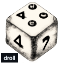

## Background

The primary objective of this project began as an investigative and learning
endeavor with the goal of developing several key components: a tokenizer, a
parser capable of generating a parse tree, and an interpreter capable of
evaluating the resulting parse tree. I chose to work with the dice notation
grammar, which, despite its apparent simplicity, contains some intricate
concepts, along with a multitude of modifiers. I have also explored this path
once before, but instead of writing everything myself, I utilized PEG
(Peggy.js).

My secondary objective is to create a versatile library that can be integrated
into different types of projects, including **rust** projects, browser-based
environments, and **NodeJS** projects, by leveraging WebAssembly (Wasm). This dual
focus on both the core functionality and cross-environment usability ultimately
forms the core of my experimentation.

## Features

`droll` consists of three main features (1/3):

- The `droll` library that can be utilized in other rust projects.

- The `droll-cli` tool that can be utilized as a free standing cli tool to parse dice notation and roll dice. (not implemented)

- The `droll-wasm` npm library that can be utilized directly in web and nodejs projects. (not implemented)

`droll` parses the dice notation by utilizing a [operator-precedence
parser](https://en.wikipedia.org/wiki/Operator-precedence_parser) according to
the following grammar rules (The grammar is [EBNF](https://en.wikipedia.org/wiki/Extended_Backus%E2%80%93Naur_form) format).

```
<expr> ::= <roll-expr>
         | <expr> '+' <expr>
         | <expr> '-' <expr>

<roll-expr> ::= <primary>
              | <expr> 'd' <expr>

<primary> ::= <number>
            | '+' <primary>
            | '-' <primary>
            | 'd' <expr>

<number> ::= <non-zero-digit> { <digit> }

<non-zero-digit> ::= '1' .. '9'

<digit> ::= '0' .. '9'
```
